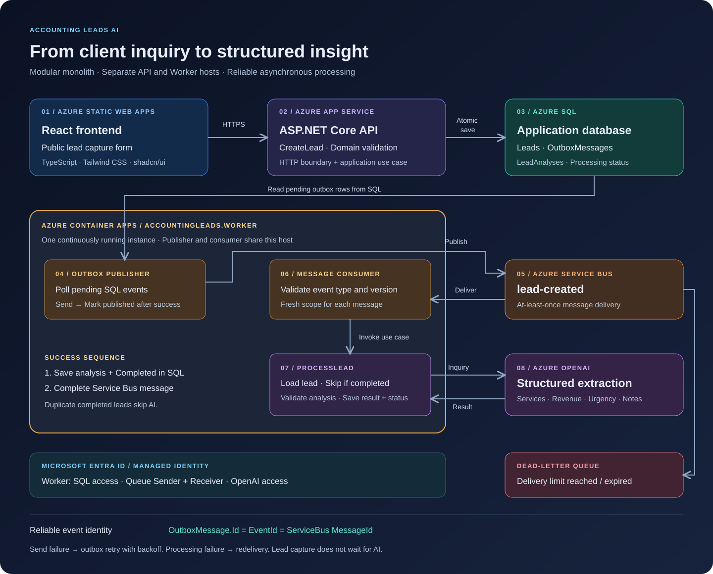
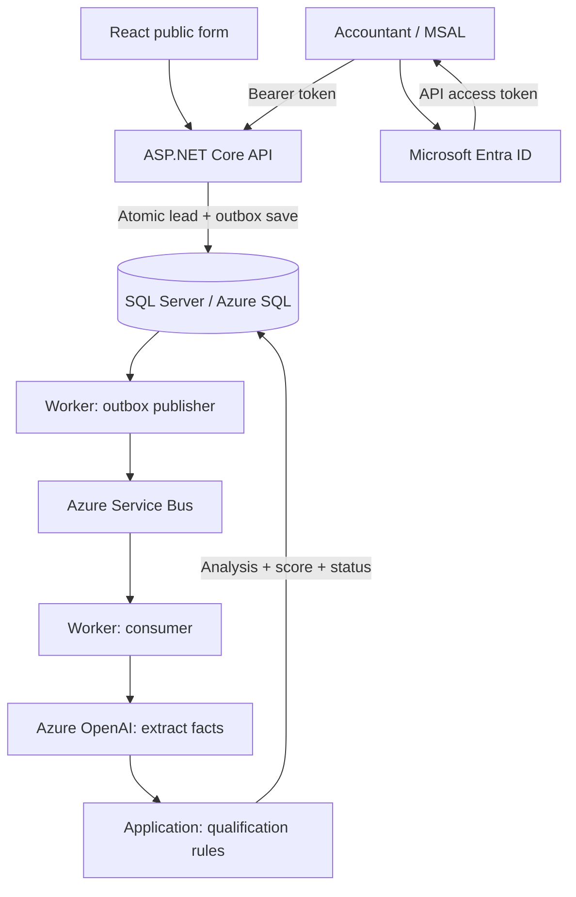

# Accounting Leads AI

A portfolio sample demonstrating reliable lead intake, asynchronous AI extraction, deterministic qualification, and employee authentication with Microsoft Entra ID.

**AI extracts facts. Application rules decide the score. Accountants retain control.**

This is a standalone source snapshot of an incrementally developed project. It contains placeholder Azure configuration and no deployment history. You can run the unit tests without an Azure account; running the complete application requires your own SQL database and Azure resources. It is not a hosted demo or a production-ready SaaS product.

## What the sample demonstrates

| Capability | Implementation |
| --- | --- |
| Public lead intake | React form, API validation, domain invariants |
| Reliable publication | Lead and outbox row saved atomically; background retries |
| AI integration | Azure OpenAI adapter returning structured analysis |
| Explainable qualification | Five deterministic scoring dimensions, priority, reasons, rules version |
| Accountant authentication | Entra single-tenant SPA/API registrations, MSAL, delegated API scope |
| Recovery UX | Sign-in errors, bounded reauthentication, account-specific queries |

The accountant dashboard includes a lead list, search/filter/pagination query support, and lead-detail routes. Response drafting, approval, and email delivery remain future work. A low score means low priority, not an automatic rejection. This export preserves the current implementation; the dashboard is not independently certified as production-ready.

## Architecture



The SVG summarizes the processing topology. The simplified flow below also shows accountant sign-in.



The API and Worker share Application, Domain, and Infrastructure projects. The architecture is a modular monolith with separate execution hosts. Azure deployment targets are Static Web Apps, App Service, Container Apps, Azure SQL, and Service Bus.

See [design decisions](docs/architecture.md) and [configuration instructions](docs/setup.md).

## Explore the code

- [Lead capture](server/src/AccountingLeads.Application/Leads/CreateLead/CreateLeadCommandHandler.cs): atomic persistence.
- [Outbox orchestration](server/src/AccountingLeads.Application/Outbox/OutboxPublicationService.cs): retry scheduling and publication status.
- [Lead processing](server/src/AccountingLeads.Application/Leads/ProcessLead/ProcessLeadCommandHandler.cs): analysis, qualification, replay handling.
- [Qualification rules](server/src/AccountingLeads.Application/Leads/Qualification/LeadQualificationService.cs): pure scoring logic.
- [API authorization](server/src/AccountingLeads.Api/Controllers/LeadsController.cs): anonymous POST, authorized/scoped GET.
- [Authentication UI](client/accounting-leads-web/src/auth): MSAL integration.

## Run the checks

Prerequisites: .NET SDK 10 and Node.js 24 with npm. SQL integration tests additionally require Windows SQL Server LocalDB.

```sh
dotnet build server/AccountingLeads.slnx
dotnet test server/tests/AccountingLeads.UnitTests/AccountingLeads.UnitTests.csproj
cd client/accounting-leads-web
npm ci
npm test
npm run build
npm run lint
```

The GitHub workflow builds the server and tests pure application/domain behavior plus the frontend. LocalDB integration tests are intentionally a separate local check, not silently replaced with an in-memory database.

## Engineering tradeoffs

- Sending a message and saving its publication timestamp cannot be atomic across SQL and Service Bus. Duplicate sends are expected; event IDs remain stable.
- One continuously running Worker is required. Multi-instance outbox coordination and queue-based scale-to-zero are not implemented.
- Qualification uses submitted facts with extracted values as fallbacks. It does not ask the model to invent a score or explanation.
- Entra owns identity. API access also requires the delegated scope; deployment must enforce explicit accountant assignment in Entra.
- Existing analyzed leads can be qualified on replay without another model call; there is no automatic bulk backfill job.

## Project provenance

Developed incrementally with AI-assisted implementation and human-directed architecture/review. Tests demonstrate specific behavior; they do not certify production readiness. The original project uses Azure DevOps. This standalone showcase adds GitHub Actions for reviewers and includes no deployed-resource credentials.

No license has been selected for this snapshot. Choose a license deliberately before offering it for reuse; publication alone does not grant an open-source license.
